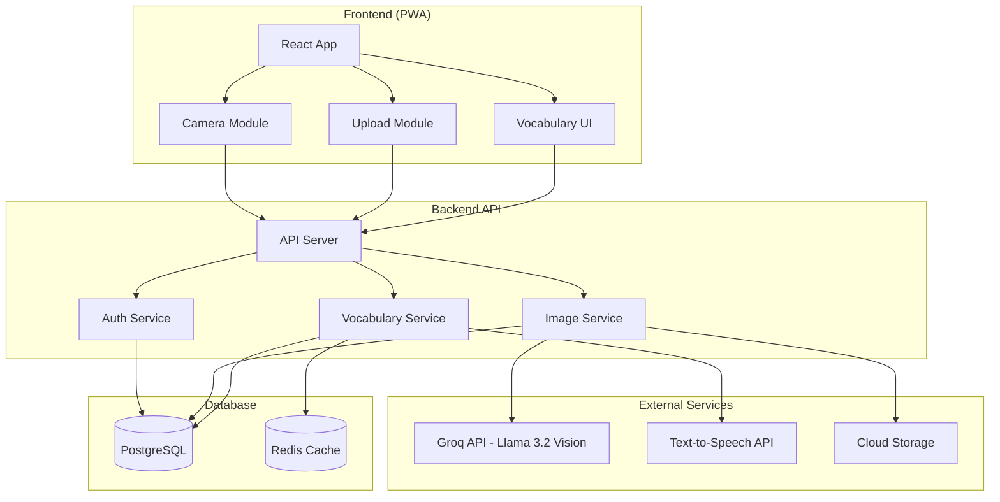
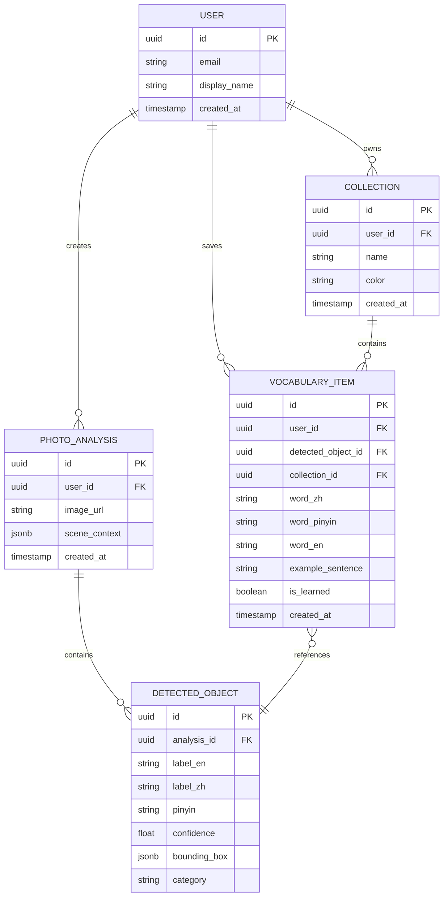

# System Design: Photo Vocabulary Detection

## Architecture Overview
**What is the high-level system structure?**



### Technology Stack

| Layer | Technology | Rationale |
|-------|------------|-----------|
| Frontend | Next.js 14 + React | Fast PWA support, SSR, great DX |
| Styling | Tailwind CSS | Rapid UI development |
| Backend | Next.js API Routes | Unified codebase, serverless-ready |
| Database | PostgreSQL (Supabase) | Reliable, good free tier, built-in auth |
| AI Vision | Groq API (Llama 3.2 Vision) | Cost-effective, fast inference, good accuracy |
| TTS | Google TTS (primary) + Web Speech API (fallback) | High-quality Chinese pronunciation, free fallback |
| Storage | Supabase Storage | Integrated with auth, simple |
| Hosting | Vercel | Zero-config Next.js deployment |

## Data Models
**What data do we need to manage?**

### Entity Relationship Diagram



### Core Schemas

**User**
```typescript
interface User {
  id: string;
  email: string;
  displayName?: string;
  createdAt: Date;
}
```

**PhotoAnalysis**
```typescript
interface PhotoAnalysis {
  id: string;
  userId: string;
  imageUrl: string;
  sceneContext: {
    description: string;
    colors: string[];
    actions: string[];
    mood?: string;
  };
  detectedObjects: DetectedObject[];
  createdAt: Date;
}
```

**DetectedObject**
```typescript
interface DetectedObject {
  id: string;
  analysisId: string;
  labelEn: string;
  labelZh: string;
  pinyin: string;
  confidence: number;
  boundingBox?: {
    x: number;
    y: number;
    width: number;
    height: number;
  };
  category: string; // e.g., "object", "color", "action"
}
```

**VocabularyItem**
```typescript
interface VocabularyItem {
  id: string;
  userId: string;
  detectedObjectId?: string;
  collectionId?: string;
  wordZh: string;
  wordPinyin: string;
  wordEn: string;
  exampleSentence?: string;
  isLearned: boolean;
  createdAt: Date;
}
```

## API Design
**How do components communicate?**

### REST API Endpoints

| Method | Endpoint | Description |
|--------|----------|-------------|
| POST | `/api/auth/signup` | Register new user |
| POST | `/api/auth/login` | Login user |
| POST | `/api/auth/logout` | Logout user |
| GET | `/api/user/me` | Get current user profile |
| POST | `/api/analyze` | Analyze photo, return vocabulary |
| GET | `/api/analyses` | Get user's analysis history |
| GET | `/api/analyses/:id` | Get specific analysis |
| DELETE | `/api/analyses/:id` | Delete analysis |
| GET | `/api/vocabulary` | Get user's saved vocabulary |
| POST | `/api/vocabulary` | Save word to vocabulary |
| DELETE | `/api/vocabulary/:id` | Remove from vocabulary |
| PUT | `/api/vocabulary/:id` | Update vocabulary item |
| GET | `/api/vocabulary/search` | Search vocabulary |
| GET | `/api/collections` | Get user's collections |
| POST | `/api/collections` | Create collection |
| PUT | `/api/collections/:id` | Update collection |
| DELETE | `/api/collections/:id` | Delete collection |

### Key API Contracts

**POST /api/analyze**
```typescript
// Request
{
  image: string; // base64 encoded image
}

// Response
{
  id: string;
  imageUrl: string;
  sceneContext: {
    description: string;
    colors: Array<{ en: string; zh: string; pinyin: string }>;
    actions: Array<{ en: string; zh: string; pinyin: string }>;
  };
  objects: Array<{
    id: string;
    labelEn: string;
    labelZh: string;
    pinyin: string;
    confidence: number;
    boundingBox?: { x: number; y: number; width: number; height: number };
  }>;
}
```

**GET /api/vocabulary/search**
```typescript
// Query params
?q=string&collection=uuid&limit=number&offset=number

// Response
{
  items: VocabularyItem[];
  total: number;
  hasMore: boolean;
}
```

### Authentication
- Use Supabase Auth (email/password for MVP)
- JWT tokens stored in httpOnly cookies
- Protected routes require valid session

## Component Breakdown
**What are the major building blocks?**

### Frontend Components

```
src/
├── app/
│   ├── page.tsx                 # Landing/home
│   ├── capture/page.tsx         # Camera capture
│   ├── upload/page.tsx          # Photo upload
│   ├── analysis/[id]/page.tsx   # Analysis results
│   ├── vocabulary/page.tsx      # Vocabulary list
│   ├── history/page.tsx         # Analysis history
│   └── auth/
│       ├── login/page.tsx
│       └── signup/page.tsx
├── components/
│   ├── ui/                      # Reusable UI components
│   ├── CameraCapture.tsx        # Camera interface
│   ├── PhotoUpload.tsx          # Upload dropzone
│   ├── AnalysisResult.tsx       # Display detected objects
│   ├── VocabularyCard.tsx       # Single word card
│   ├── VocabularyList.tsx       # Word list with search
│   ├── CollectionPicker.tsx     # Collection selector
│   └── ShareButton.tsx          # Social sharing
├── lib/
│   ├── supabase.ts              # Supabase client
│   ├── api.ts                   # API helpers
│   └── utils.ts                 # Utility functions
└── hooks/
    ├── useCamera.ts             # Camera access hook
    ├── useVocabulary.ts         # Vocabulary CRUD hook
    └── useAnalysis.ts           # Analysis hook
```

### Backend Services

```
src/app/api/
├── auth/
│   ├── signup/route.ts
│   ├── login/route.ts
│   └── logout/route.ts
├── analyze/route.ts             # Main analysis endpoint
├── analyses/
│   ├── route.ts                 # List analyses
│   └── [id]/route.ts            # Single analysis
├── vocabulary/
│   ├── route.ts                 # CRUD vocabulary
│   ├── [id]/route.ts            # Single item
│   └── search/route.ts          # Search endpoint
└── collections/
    ├── route.ts
    └── [id]/route.ts
```

## Design Decisions
**Why did we choose this approach?**

### Decision 1: Next.js Full-Stack
**Choice:** Use Next.js for both frontend and backend  
**Alternatives:** Separate React + Express, or React + Python FastAPI  
**Rationale:** Single codebase reduces complexity, Vercel deployment is seamless, API routes handle our simple needs

### Decision 2: Supabase for Backend Services
**Choice:** Supabase (PostgreSQL + Auth + Storage)  
**Alternatives:** Firebase, self-hosted PostgreSQL + custom auth  
**Rationale:** Generous free tier, excellent DX, PostgreSQL for complex queries, built-in auth saves development time

### Decision 3: Groq API with Llama 3.2 Vision
**Choice:** Groq API with Llama 3.2 Vision (11B or 90B)  
**Alternatives:** OpenAI GPT-4 Vision, Google Cloud Vision, AWS Rekognition  
**Rationale:** Significantly lower cost, extremely fast inference (~10x faster than competitors), Llama 3.2 Vision provides good accuracy for object detection, can provide Chinese translations via prompt engineering

### Decision 4: Google TTS with Web Speech Fallback
**Choice:** Google Text-to-Speech API (primary), Web Speech API (fallback)  
**Alternatives:** Azure TTS, AWS Polly, pre-recorded audio  
**Rationale:** Google TTS provides high-quality Chinese pronunciation with natural tones. Web Speech API as fallback ensures functionality even if Google TTS is unavailable (network issues, quota exceeded). This hybrid approach balances quality with reliability.

### Decision 5: Base64 Image Upload
**Choice:** Send images as base64 to analyze endpoint  
**Alternatives:** Upload to storage first, then send URL  
**Rationale:** Simpler flow, can store in DB if needed, or upload to storage after analysis

## Non-Functional Requirements
**How should the system perform?**

### Performance
- Photo analysis: < 5 seconds (depends on AI API)
- Page load: < 2 seconds (LCP)
- Vocabulary search: < 200ms
- Image upload: < 3 seconds for 5MB image

### Scalability
- Supabase free tier: 500MB database, 1GB storage
- Groq API: Very affordable pricing, fast response times
- Vercel: Auto-scaling serverless functions

### Security
- All API routes require authentication (except public pages)
- Images stored with user-scoped access
- Input validation on all endpoints
- Rate limiting on analyze endpoint (prevent abuse)

### Reliability
- Graceful degradation if AI API fails
- Offline-aware UI (show cached vocabulary)
- Error boundaries in React

### Accessibility
- WCAG 2.1 AA compliance
- Keyboard navigation
- Screen reader support for vocabulary cards
- Proper color contrast


