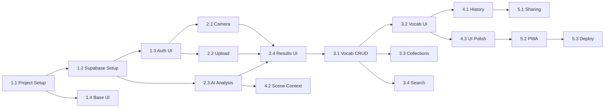

# Project Planning: Photo Vocabulary Detection

## Milestones
**What are the major checkpoints?**

- [ ] **Milestone 1: Foundation** - Project setup, auth, basic UI shell (Week 1)
- [ ] **Milestone 2: Core Feature** - Photo capture/upload + AI analysis (Week 2)
- [ ] **Milestone 3: Vocabulary Management** - Save, organize, search vocabulary (Week 3)
- [ ] **Milestone 4: History & Polish** - History view, scene context, UI polish (Week 4)
- [ ] **Milestone 5: Social & Deploy** - Sharing feature, PWA setup, production deploy (Week 5)

## Task Breakdown
**What specific work needs to be done?**

### Phase 1: Foundation (Week 1)

#### 1.1 Project Setup
- [ ] Initialize Next.js 14 project with TypeScript
- [ ] Configure Tailwind CSS
- [ ] Set up project structure (components, lib, hooks, api)
- [ ] Configure ESLint and Prettier
- [ ] Set up environment variables structure

#### 1.2 Supabase Setup
- [ ] Create Supabase project
- [ ] Design and create database schema (users, analyses, vocabulary, collections)
- [ ] Configure Supabase Auth (email/password)
- [ ] Set up Supabase Storage bucket for images
- [ ] Configure Row Level Security (RLS) policies

#### 1.3 Authentication UI
- [ ] Create login page
- [ ] Create signup page
- [ ] Implement auth context/provider
- [ ] Add protected route middleware
- [ ] Create user menu component (avatar, logout)

#### 1.4 Base UI Components
- [ ] Set up UI component library (shadcn/ui or custom)
- [ ] Create layout component (header, navigation, footer)
- [ ] Create loading states and skeletons
- [ ] Create error boundary and error states
- [ ] Design and implement color scheme/theme

### Phase 2: Core Feature (Week 2)

#### 2.1 Camera Capture
- [ ] Create camera capture component (WebRTC)
- [ ] Implement camera permissions handling
- [ ] Add capture button and preview
- [ ] Handle camera errors gracefully
- [ ] Test on mobile browsers (iOS Safari, Android Chrome)

#### 2.2 Photo Upload
- [ ] Create upload dropzone component
- [ ] Implement file validation (type, size)
- [ ] Add image preview before analysis
- [ ] Handle drag-and-drop
- [ ] Add paste from clipboard support

#### 2.3 AI Analysis Integration
- [ ] Set up Groq API client (groq-sdk)
- [ ] Design prompt for object detection + Chinese vocabulary
- [ ] Create analyze API endpoint
- [ ] Implement image processing (resize, compress)
- [ ] Parse AI response into structured data
- [ ] Store analysis results in database
- [ ] Upload image to Supabase Storage

#### 2.4 Analysis Results UI
- [ ] Create analysis result page
- [ ] Display detected objects with bounding boxes (if available)
- [ ] Show vocabulary cards (汉字, Pinyin, English)
- [ ] Add "Save to Vocabulary" button per word
- [ ] Implement loading state during analysis

### Phase 3: Vocabulary Management (Week 3)

#### 3.1 Vocabulary CRUD
- [ ] Create vocabulary list API endpoint
- [ ] Create save vocabulary API endpoint
- [ ] Create delete vocabulary API endpoint
- [ ] Create update vocabulary API endpoint

#### 3.2 Vocabulary UI
- [ ] Create vocabulary list page
- [ ] Design vocabulary card component
- [ ] Add pronunciation button (Web Speech API)
- [ ] Implement "learned" toggle
- [ ] Add delete confirmation

#### 3.3 Collections
- [ ] Create collections API endpoints
- [ ] Create collection management UI
- [ ] Add "Add to Collection" picker
- [ ] Implement collection filtering on vocabulary page

#### 3.4 Search
- [ ] Create vocabulary search API endpoint
- [ ] Add search bar to vocabulary page
- [ ] Implement search results display
- [ ] Add search by Chinese, Pinyin, or English

### Phase 4: History & Polish (Week 4)

#### 4.1 History View
- [ ] Create analyses list API endpoint
- [ ] Create history page
- [ ] Display past analyses as cards with thumbnails
- [ ] Add click to view analysis details
- [ ] Implement delete analysis

#### 4.2 Scene Context Enhancement
- [ ] Enhance AI prompt for scene context (colors, actions, relationships)
- [ ] Display scene description on analysis page
- [ ] Show color vocabulary with visual swatches
- [ ] Show action/verb vocabulary

#### 4.3 UI Polish
- [ ] Add animations and transitions
- [ ] Improve mobile responsiveness
- [ ] Add empty states for lists
- [ ] Implement toast notifications
- [ ] Add keyboard shortcuts

#### 4.4 Error Handling
- [ ] Add comprehensive error handling
- [ ] Create user-friendly error messages
- [ ] Implement retry logic for failed requests
- [ ] Add offline detection

### Phase 5: Social & Deploy (Week 5)

#### 5.1 Social Sharing
- [ ] Create shareable analysis card component
- [ ] Generate image with vocabulary overlay
- [ ] Implement Web Share API
- [ ] Add fallback share options (copy link, download image)

#### 5.2 PWA Setup
- [ ] Create manifest.json
- [ ] Add service worker for caching
- [ ] Create app icons (all sizes)
- [ ] Add splash screens
- [ ] Test install prompt

#### 5.3 Production Deployment
- [ ] Set up Vercel project
- [ ] Configure production environment variables
- [ ] Set up custom domain (if available)
- [ ] Configure analytics (optional)
- [ ] Test production build

#### 5.4 Final Testing
- [ ] End-to-end testing of all flows
- [ ] Performance testing (Lighthouse)
- [ ] Mobile device testing
- [ ] Fix any remaining bugs

## Dependencies
**What needs to happen in what order?**

### External Dependencies
- Groq API key (free tier: 14,400 requests/day)
- Google Cloud TTS API key (free tier: 1M characters/month)
- Supabase project credentials
- Vercel account for deployment

### Blockers
- Camera access requires HTTPS (use localhost for dev, ngrok for mobile testing)
- Groq API rate limits (generous free tier, but monitor usage)

## Timeline & Estimates
**When will things be done?**

| Phase | Duration | Tasks | Risk Level |
|-------|----------|-------|------------|
| Foundation | 5 days | 20 tasks | Low |
| Core Feature | 5 days | 16 tasks | Medium (AI integration) |
| Vocabulary Mgmt | 4 days | 12 tasks | Low |
| History & Polish | 4 days | 13 tasks | Low |
| Social & Deploy | 3 days | 12 tasks | Low |
| **Total** | **~21 days** | **73 tasks** | |

### Buffer
- Add 20% buffer for unknowns: ~4-5 days
- **Total estimated timeline: 4-5 weeks**

## Risks & Mitigation
**What could go wrong?**

| Risk | Likelihood | Impact | Mitigation |
|------|------------|--------|------------|
| Groq/Llama Vision accuracy issues | Medium | High | Test with diverse images, refine prompts, consider 90B model |
| Camera access issues on iOS | Medium | Medium | Extensive mobile testing, clear error messages |
| Chinese translation quality | Medium | Medium | Review and validate translations, may need post-processing |
| Supabase free tier limits | Low | Medium | Monitor usage, plan upgrade path |
| Groq rate limits hit | Low | Low | Generous free tier (14,400/day), implement client-side throttling |
| Slow AI response time | Low | Low | Groq is fast (~500ms), show loading state anyway |

## Resources Needed
**What do we need to succeed?**

### Accounts & Services
- [ ] Groq API account (free tier available at console.groq.com)
- [ ] Google Cloud account with TTS API enabled (free tier: 1M chars/month)
- [ ] Supabase account (free tier)
- [ ] Vercel account (free tier)
- [ ] Domain name (optional)

### Development Tools
- [ ] Node.js 18+
- [ ] VS Code or Cursor
- [ ] Mobile devices for testing (iOS + Android)
- [ ] ngrok for HTTPS testing on mobile

### Documentation & References
- [ ] Groq API docs (console.groq.com/docs)
- [ ] Llama 3.2 Vision model capabilities
- [ ] Supabase docs (Auth, Database, Storage)
- [ ] Next.js 14 docs
- [ ] Web Speech API docs
- [ ] PWA documentation

